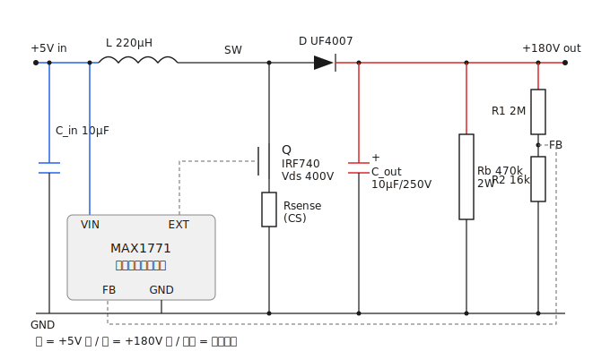
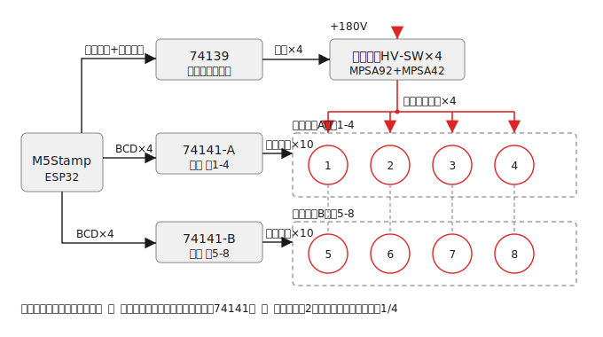
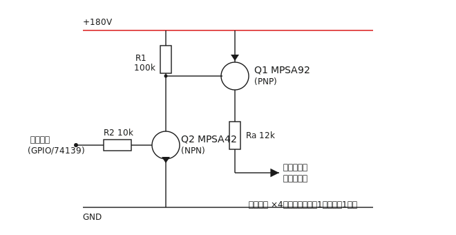
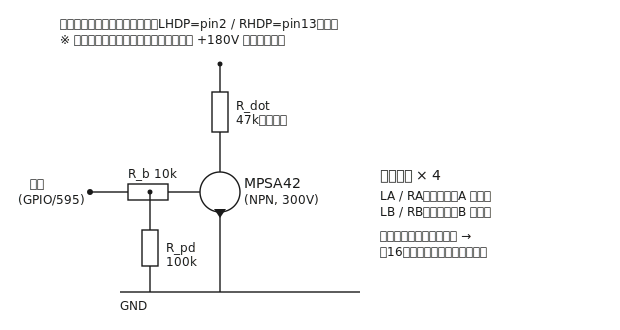

# Divergence Meter（ニキシー管時計）

Steins;Gate のダイバージェンスメーターを模した、ニキシー管 **IN-14 × 8桁** の時計プロジェクト。
マイコンに **M5Stamp**（ESP32系）を使い、5V 電源から高電圧を昇圧してニキシー管を駆動する。

## 特徴 / 仕様

- **表示管**: IN-14  × 8桁（ダイバージェンスメーター風の見た目）
- **点灯方式**: ダイナミック点灯（1/4 多重化：2グループ×4スロット）
- **マイコン**: M5Stamp（5V / USB 給電）
- **高電圧電源**: 5V → 約 180V に昇圧するブーストコンバータを自作
- **給電**: モバイルバッテリー（USB 5V）で持ち運び可。単段昇圧のまま動作（LiPo 内蔵化は将来の発展案）

## IN-14 データシート要点

| 項目 | 値 |
|---|---|
| 表示 | 数字 0〜9 |
| 点火電圧（firing） | ≤ 170V |
| 維持電圧（upkeep） | 150〜200V |
| 管電流（indication） | 2.5mA |
| マーキング電流 | 2.5〜3.5mA |

### ピンアサイン

| Pin | 機能 | Pin | 機能 |
|---|---|---|---|
| 1 | Anode | 8 | K6 |
| 2 | LHDP（左ドット） | 9 | K7 |
| 3 | K1 | 10 | K8 |
| 4 | K2 | 11 | K9 |
| 5 | K3 | 12 | K0 |
| 6 | K4 | 13 | RHDP（右ドット） |
| 7 | K5 | | |

## 電源設計（5V → 180V 昇圧）

ダイナミック点灯では同時に光るのは1桁のみのため、HV 側の電流は約 2.5〜3.5mA（桁切替の重なりを見込んで最大 5mA）。

- HV 出力電力: 180V × 5mA ≈ 0.9W
- 効率 80% で入力 ≈ 1.1W → **5V 換算で約 0.22A**（USB 給電で十分）

### 回路図



> 青 = +5V 系 / 赤 = +180V 系 / 破線 = 制御信号

### 昇圧回路（MAX1771 ブースト構成）

| 部品 | 値 / 型番 | 備考 |
|---|---|---|
| コントローラ | MAX1771 | ニキシー電源の定番。FB基準 1.5V / 電流検出 100mV |
| インダクタ L | **47µH** / 飽和 2A 以上 | 5V入力では大きすぎると周波数が落ちる（後述の根拠参照） |
| MOSFET Q | IRF740 / IRF830（Vds ≥ 400V） | 5V ゲートで半導通。理想は低Vth高耐圧品（STD3NK60Z 系など） |
| ダイオード D | UF4007 / ES1J | **高速整流必須**（一般整流は不可） |
| 出力コンデンサ C_out | 4.7〜10µF / **250V** + 100nF/250V | 耐圧マージン必須 |
| 入力コンデンサ C_in | 低ESR 10〜22µF + 100nF | ピーク約 1A を供給 |
| 電流検出 Rsense | **0.1Ω** / 0.5〜1W（低インダクタンス品） | ピーク電流制限を約 1A に設定 |
| FB 分圧 | R1 = **1.8MΩ** : R2 = **15kΩ** | 出力 ≒ 181.5V。R2 は半固定込みで校正 |
| ブリーダ抵抗 Rb | 470kΩ / 2W | 電源 OFF 後の放電用（**感電防止・必須**） |

### 主要定数の根拠

**出力電圧（R1 / R2）** — `Vout = 1.5V × (1 + R1/R2)`

```
R1/R2 = Vout/1.5 - 1 = 180/1.5 - 1 = 119
R1 = 1.8MΩ, R2 = 15kΩ → Vout = 1.5 × (1 + 120) = 181.5V
```

- R2 は半固定抵抗込み（例: 12kΩ + 10kΩトリマ）で 160〜200V を実測校正。
- R1 には 180V がかかるため、910kΩ×2本直列など**耐電圧を確保した分割**にする。

**ピーク電流制限（Rsense）** — `Ipeak = 100mV / Rsense`

```
出力 0.9W / 効率75% → 入力 ≈ 1.2W → 平均入力電流 ≈ 0.24A
ピーク制限を約 1A に設定 → Rsense = 100mV / 1A = 0.1Ω
```

**インダクタ（L）** — `t_on = L × Ipeak / Vin`

```
L=47µH, Ipeak=1A, Vin=5V → t_on ≈ 9.4µs（数十kHz で動作、最大300kHz内）
※ L=220µH では t_on≈44µs となり周波数が落ちて電力を送れない
```

### 各桁のアノード抵抗

出力 180V、管維持電圧 ≈ 150V 前提で 2.5mA に制限:

```
R = (180 - 150) / 2.5mA ≈ 12kΩ（10〜15kΩ, 1/2W）
```

ダイナミック点灯のため、各桁のアノードごとに 1 本ずつ配置する（計 8 本）。

## 点灯ドライブ（1/4 多重化）

8 桁を 2 グループ（A=桁1-4 / B=桁5-8）に分け、4 スロット × 2 グループで多重化する。
毎スロット 2 桁が点灯し、各桁のデューティは 1/4。



### 構成

| ブロック | 部品 | 役割 |
|---|---|---|
| シリアル制御 | **74HCT595 × 2** | M5Stamp 3 本を 16bit パラレルに展開 |
| カソード（数字選択） | **74141 × 2** | 各グループのカソードバス10本を駆動（0-9） |
| アノード（桁選択） | **高圧ハイサイドSW × 4** | +180V を該当列のアノードへ供給（595 から直接ワンホット） |
| ドット（左右側点） | **MPSA42 × 4** | LA / RA / LB / RB を駆動 |
| アノード抵抗 | 10〜15kΩ × 8 | 各管の電流制限 |

- アノードバス k はグループ A の k 桁目と B の k 桁目を**同時に駆動**（4 本で 8 桁をカバー）。
- カソードは各グループ内で同名どうしをバス接続し、74141 でシンクする数字を選ぶ。
- 桁スロット選択は **595 の 4bit を直接ワンホット出力**で行うため 74139 は不要。

### アノード側 高圧ハイサイドスイッチ（×4）



`MPSA92(PNP) + MPSA42(NPN)` の 2 石構成。制御入力 HIGH → Q2 ON → Q1 のベースを引き下げ → Q1 ON → アノードに +180V を供給。
595 の出力（または GPIO）で直接駆動できる。

### 制御ピン（74HCT595 × 2 でシリアル化）

直結なら制御線は 15 本必要だが、**74HCT595 を 2 個デイジーチェーン**して M5Stamp 側を **3〜4 本**に圧縮する。

**M5Stamp ピン:**

| ピン | 接続 | 用途 |
|---|---|---|
| SER（Data） | 595 #1 の DS | シリアルデータ |
| SRCLK（Clock） | 両 595 の SHCP | シフトクロック |
| RCLK（Latch） | 両 595 の STCP | ラッチ |
| OE（任意） | 両 595 の OE | 輝度 PWM / 全消灯 |

**595 ビット割り当て（16bit = 2 バイト送出）:**

| IC.bit | 割り当て |
|---|---|
| #1 Q0-Q3 | 74141-A BCD（A0..A3） |
| #1 Q4-Q7 | 74141-B BCD（B0..B3） |
| #2 Q0-Q3 | アノードスロット選択 ×4（ワンホット） |
| #2 Q4-Q7 | ドット LA / RA / LB / RB |

- **74HCT595 推奨**（VIH=2V なので 3.3V GPIO で確実に High）。74HC595 を 5V 電源で使うと VIH≈3.5V となり 3.3V GPIO ではマージン不足。
- ブランキングは「アノード 4bit を全 0」または OE で全消灯。**OE に PWM** を入れれば輝度調整になる。
- 残った GPIO は RTC（I2C 2 本）・ボタン・ブザー等に回せる。

### 多重化タイミング

- 全体リフレッシュ 100〜200Hz（スロット 400〜800Hz, 約 1.25〜2.5ms/スロット）
- スロット間に **ブランキング 50〜100µs**（前桁の消イオン待ち＝ゴースト防止、アノード OFF）

### レベルシフト

- M5Stamp（3.3V）→ 595 は **74HCT595** を 5V 電源で使えば VIH=2V なので直結で確実。
- 595（5V 出力）→ 74141・各トランジスタ base は 5V ロジックで駆動され、最も確実。

### ドット（LHDP / RHDP）

74141 は 0-9 のみのため、ドット（左右の側点）は別系統で駆動する。
ドットは各管内の**別カソード**で、数字と同じアノードを共有する。



- グループごとに左右ドットをバス接続（**LA / RA / LB / RB の 4 本**）。
- 各バスを高耐圧 NPN（**MPSA42, 300V**）でオープンコレクタ駆動（OFF 時に約 150〜180V を耐える）。
- 直列の `R_dot`（約 47kΩ、要調整）でドット電流を 0.5〜1mA 程度に制限。
- スロットに同期して制御することで、**全 16 ドット（8 管 × 左右）を時分割で個別点灯**できる。

> 数字とドットを同じ管で同時点灯すると、共有するアノード抵抗に両方の電流が流れて
> やや暗くなる。気になる場合はその管のアノード電流を増やす（アノード抵抗を下げる）か、
> 演出上ドットと数字の同時点灯を避ける。

## 設計上の注意点

1. **安全第一** — 基板に 180V が乗る。ブリーダ抵抗で OFF 後に放電すること。
2. **ゲート駆動 5V 問題** — 効率を詰めるならゲートドライバ追加、または元電源 9〜12V 化も選択肢。
3. **ダイナミックの再点火** — 桁切替のたびに 170V 以上での再点火が必要。リップルで 170V を割らないよう出力コンデンサとリフレッシュ周波数を設計する。

## ロードマップ

- [x] 電源要件の整理（IN-14 データシート）
- [x] 5V → 180V 昇圧回路の方針決定
- [x] 昇圧回路の回路図起こし（MAX1771 FB / Rsense 具体値の確定）
- [x] 点灯ドライブ設計（1/4 多重化：74141×2 + アノード側ハイサイドSW×4）
- [x] ドット（LHDP/RHDP）駆動の追加設計
- [ ] 基板設計（桁配置・ドット割り当て）
- [ ] M5Stamp ファームウェア（時刻管理・ダイナミック点灯制御・NTP 同期など）
- [ ] 筐体設計

## ライセンス

[MIT License](LICENSE)
